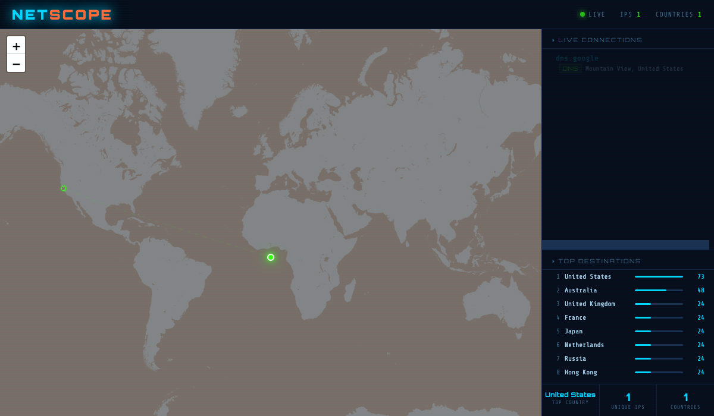

# NetScope

Real-time network traffic visualizer. Sniffs your machine's live network activity
and plots it on a world map as it happens — outbound connections you make (visiting
sites, DNS lookups) and unsolicited inbound connection attempts (probes/scans hitting
your machine from the outside).


## Screenshot



## Why

Most people have no visibility into where their traffic actually goes, or when
something on the internet is knocking on their machine's ports. NetScope makes both
visible in real time, on a map, instead of buried in a packet capture tool built for
protocol analysis rather than at-a-glance situational awareness.

## Tech stack

Python · [Scapy](https://scapy.net/) (packet capture) · [Flask](https://flask.palletsprojects.com/) +
[Flask-SocketIO](https://flask-socketio.readthedocs.io/) (backend + WebSocket streaming) ·
[Leaflet.js](https://leafletjs.com/) (map rendering) · [MaxMind GeoLite2](https://dev.maxmind.com/geoip/geolite2-free-geolocation-data) (IP geolocation)

## What it does

- Captures new outbound connections (TCP SYN, DNS queries) and unsolicited inbound
  SYNs from the network interface using [Scapy](https://scapy.net/)
- Resolves each remote IP to a location via a local [MaxMind GeoLite2](https://dev.maxmind.com/geoip/geolite2-free-geolocation-data)
  database (no third-party API calls, no rate limits)
- Streams events to the browser over WebSockets ([Flask-SocketIO](https://flask-socketio.readthedocs.io/))
  and animates them as arcs on a [Leaflet](https://leafletjs.com/) map in real time
- Downloads its own GeoIP database and relaunches itself with `sudo` as needed —
  `python3 app.py` with a [MaxMind license key](#2-get-a-free-maxmind-license-key)
  set is enough to get live traffic, no manual file placement required
- Falls back to a scripted demo mode if no GeoIP database is available at all,
  so the UI is still explorable with zero setup

## Signal, not noise

An earlier version logged every packet on the wire, which mostly meant firehosing
retransmits, ACKs, and keepalives from every open connection. The sniffer now only
emits an event for:

- **Outbound** — the SYN that opens a new TCP connection, or a DNS query. This is
  "you asked for something," not "your browser's already-open connection sent
  another chunk of data."
- **Inbound** — an unsolicited SYN from a public IP with no matching connection
  we opened (flagged `PROBE` in the feed, drawn in red). This is a scan or
  connection attempt from the internet, not a reply to something you did.

Both filters are applied at the packet-capture level (a BPF filter compiled into
the kernel's socket filter) so the noise never reaches Python, and repeat hits from
the same host are deduplicated for a short window so one chatty remote can't flood
the feed.

## Setup

### 1. Install dependencies

```bash
pip install -r requirements.txt
```

### 2. Get a free MaxMind license key

The IP → location lookups run against a local [GeoLite2 City database](https://dev.maxmind.com/geoip/geolite2-free-geolocation-data)
instead of a rate-limited third-party API. MaxMind's license doesn't allow
redistributing the database itself, so it isn't in this repo — but you don't
need to hunt it down and place it manually:

1. Create a free account at [maxmind.com/en/geolite2/signup](https://www.maxmind.com/en/geolite2/signup)
2. Generate a license key at [Account → License Keys](https://www.maxmind.com/en/accounts/current/license-key)
3. Set it as an environment variable:

   ```bash
   export MAXMIND_LICENSE_KEY="your_key_here"
   ```

With that set, `app.py` downloads `GeoLite2-City.mmdb` itself on first run — no
manual download, no manual file placement. (If you'd rather do it by hand —
e.g. no internet access to MaxMind from this machine — download the City
edition yourself and drop `GeoLite2-City.mmdb` next to `app.py`; the app skips
the download step automatically when the file's already there.)

### 3. (Optional) Set your approximate location

The arcs originate from downtown Minneapolis by default. A city-level origin is
intentional — the map is about where traffic *goes*, not about publishing the
operator's exact location. To point it somewhere else:

```bash
export NETSCOPE_LAT=47.61
export NETSCOPE_LON=-122.33
export NETSCOPE_LABEL="You (Seattle)"
```

### 4. Run it

**macOS / Linux**

```bash
python3 app.py
```

Packet capture needs root, but you don't need to remember `sudo` — when a GeoIP
database is available, `app.py` notices it isn't elevated and re-executes itself
under `sudo`, preserving your virtualenv and environment variables and prompting
for your password once.

**Windows**

Windows has no `sudo` to re-execute through, so start an **elevated** terminal
first (right-click PowerShell or Command Prompt → *Run as administrator*), then:

```powershell
python app.py
```

Scapy also needs the [Npcap](https://npcap.com/) capture driver, which is not a
pip package — install it separately and enable *WinPcap API-compatible mode*
during setup. NetScope checks for both the driver and Administrator rights at
startup and tells you which one is missing rather than failing mid-capture.

**Either platform:** if live capture isn't possible, the app falls back to demo
mode rather than exiting, and the status badge reads `DEMO DATA` instead of
`LIVE CAPTURE` so scripted traffic is never mistaken for real traffic.

Opens a native window if [pywebview](https://pywebview.flowrl.com/) is installed,
otherwise opens `http://127.0.0.1:6767` in your default browser.

## Tests

The packet classification logic (SYN/probe/dedup filtering), the dedup table's
memory bound, and the platform-detection helpers are unit tested. None of it
needs root, a real GeoLite2 database, or a network — geo lookups are stubbed:

```bash
pip install -r requirements-dev.txt
pytest
```

## Responsible use

This is a packet-sniffing tool. Only run it against network interfaces on machines
and networks you own or are explicitly authorized to monitor. It only inspects
packet headers (source/destination, ports, flags) to classify traffic — it never
reads payload data.

## Security notes

A few decisions worth calling out, since this is a security-adjacent tool:

- **The server is loopback-only.** It binds `127.0.0.1`, never `0.0.0.0`, so the
  dashboard isn't reachable from the network.
- **Remote-controlled strings are escaped before rendering.** A reverse-DNS
  hostname is chosen by whoever controls the remote IP's PTR record, which makes
  it untrusted input arriving from off-machine. Everything interpolated into the
  live feed is HTML-escaped, and the protocol badge is restricted to a known set
  rather than passed through into a CSS class.
- **Headers only, never payloads.** Classification uses addresses, ports and TCP
  flags; packet contents are never read or stored.
- **No credentials in the repo.** The MaxMind key is read from
  `MAXMIND_LICENSE_KEY` at runtime, and the GeoLite2 database is gitignored —
  MaxMind's license doesn't permit redistributing it.

## Known limitations / what I'd improve with more time

- GeoLite2's free tier doesn't have location data for every IP (notably some
  anycast DNS resolvers and reserved/documentation ranges) — those are silently
  dropped rather than shown with a fallback location.
- Direction detection assumes a single local IP per interface; a multi-homed
  machine (VPN + LAN active at once) may misclassify some flows.
- No persistence — the feed and stats reset every time the app restarts. Recording
  history to a lightweight local DB would let you look at patterns over time.
- No automated CI (lint/test-on-push); tests exist (`tests/`) but currently run
  manually.
- The auto-`sudo` relaunch runs the whole process as root, including the
  pywebview desktop window — macOS is occasionally particular about GUI apps
  running as root. If the native window doesn't appear after entering your
  password, `Ctrl+C` and run `sudo python3 app.py` directly, or `pip uninstall
  pywebview` to fall back to the plain-browser mode.
- On Windows the app can't elevate itself: launching a UAC prompt would spawn a
  detached console where you'd never see the output, so it detects the problem
  and explains the fix rather than trying to fix it for you.
- The map arcs are drawn with interpolation plus a bowed midpoint rather than a
  true great-circle path. It reads correctly at world zoom, which is what the
  view is for, but it isn't a geodesically accurate line.

## Notes

- The server binds to `127.0.0.1` only — it's a local tool, not meant to be exposed
  on a network.
- Without a GeoIP database (and no `MAXMIND_LICENSE_KEY` to fetch one), it runs in
  demo mode with scripted sample traffic so the UI still works.
