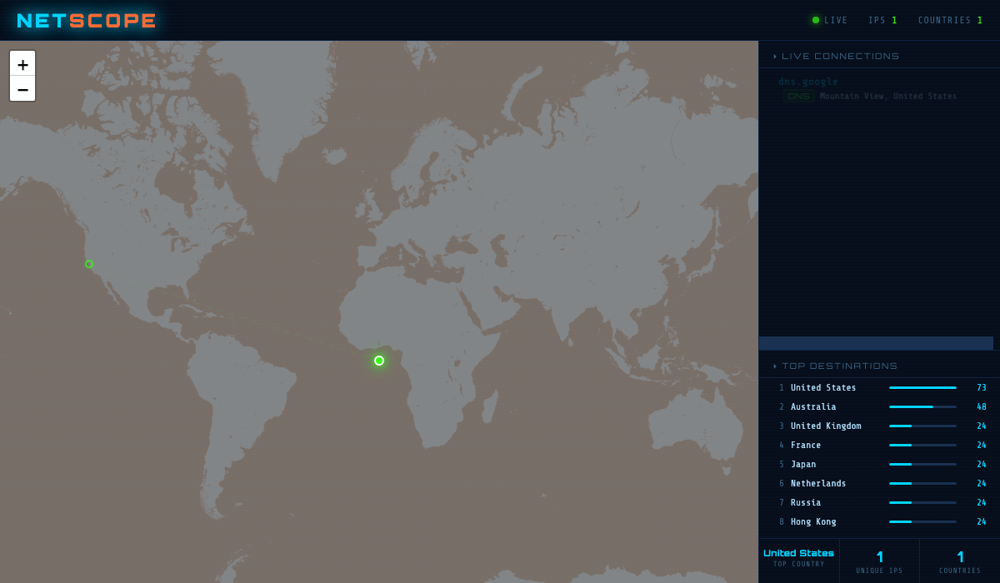

# NetScope

**See where your computer's network traffic actually goes, live, on a world map.**

NetScope watches your machine's new connections and plots them as they happen: the sites you visit and the DNS lookups you make (outbound), and unsolicited connection attempts from the internet (inbound probes, drawn in red).

[](https://github.com/AndrewGambucci/NetScope/actions/workflows/ci.yml)




## Install

Download the latest build from the [**Releases**](https://github.com/AndrewGambucci/NetScope/releases/latest) page.

### macOS
1. Download `NetScope-<version>-macos-<arch>.dmg`, open it, and drag **NetScope** to **Applications** (or straight to your Desktop or Dock).
2. First launch: **right-click the app → Open → Open**. (Release builds aren't notarised yet, so macOS asks once.)
3. When asked, enter your password in the macOS dialog. NetScope needs it to read packet headers, and only a tiny helper process is elevated, never the window.

### Windows
1. Install **[Npcap](https://npcap.com/#download)**, the free packet-capture driver. Tick **"WinPcap API-compatible Mode"** in its installer. (The NetScope installer reminds you if it's missing.)
2. Run `NetScope-<version>-windows-setup.exe`. Leave **Create a desktop shortcut** ticked.
3. First launch: if SmartScreen warns, click **More info → Run anyway** (release builds aren't code-signed yet). Approve the UAC prompt so NetScope can capture packets.

### With pip (any macOS or Windows machine with Python 3.10+)
```bash
pip install git+https://github.com/AndrewGambucci/NetScope
netscope                      # run it
netscope --create-shortcut    # put a NetScope icon on your Desktop
```
On Windows you still need [Npcap](https://npcap.com/#download) first.

## First run
- **The location database downloads automatically** (about 60 MB, once; no account or key). It's refreshed monthly.
- **Click "Set location"** in the top bar, then click the map where you are. That's where arcs start from. It's saved, and you can change it any time.
- If you'd rather not grant capture permission yet, click **Show demo** (or run `netscope --demo`) to explore the UI with simulated traffic.

## What you're looking at
| Colour | Meaning |
|---|---|
| cyan | HTTPS connection you opened |
| orange | HTTP connection you opened |
| green | DNS lookup you made |
| grey-blue | other TCP connection you opened |
| **red** | **inbound PROBE**: something on the internet tried to connect to your machine unprompted |

Only *new* connections are shown (a TCP SYN or a DNS query), not every packet, so the feed stays readable. Repeats from the same host are collapsed for 20 seconds.

## Command line
```
netscope [--demo] [--no-capture] [--no-window] [--port N] [--create-shortcut] [--version] [-v]
```
| Option | |
|---|---|
| `--demo` | simulated traffic, no permissions needed |
| `--no-capture` | start the UI without asking for capture permission |
| `--no-window` | use your web browser instead of the native window |
| `--create-shortcut` | create a Desktop launcher (pip installs) |

## Configuration
Everything works with no configuration. Optional environment variables:

| Variable | Purpose |
|---|---|
| `NETSCOPE_LAT`, `NETSCOPE_LON`, `NETSCOPE_LABEL` | your location (overrides the saved one) |
| `NETSCOPE_IGNORE_CIDRS` | comma-separated ranges to hide. Default `17.0.0.0/8` (Apple's background traffic); set empty to show everything |
| `MAXMIND_LICENSE_KEY` | download MaxMind GeoLite2 instead of DB-IP (a `GeoLite2-City.mmdb` in the data folder is also used) |
| `NETSCOPE_DATA_DIR` | override where NetScope keeps its files |

Files live in `~/Library/Application Support/NetScope` (macOS) or `%APPDATA%\NetScope` (Windows): the location database, `config.json`, and `netscope.log`.

## How it works
```
 unprivileged                                           elevated (macOS password / Windows UAC)
┌───────────────────────────────────────────┐          ┌─────────────────────────────┐
│ native window ⇄ Flask + Socket.IO server   │ ◄─ 127.0.0.1, token ─ │ capture helper (Scapy)       │
│ GeoIP lookup · de-dupe · reverse DNS · map │          │ BPF filter → classify packets │
└───────────────────────────────────────────┘          └─────────────────────────────┘
```
- The helper is the **only** code that runs with elevated rights. It reads packet *headers* (addresses, ports, TCP flags), sends compact events to the app over a loopback socket authenticated with a random token, and exits when the app does.
- A kernel BPF filter (`SYN-only TCP, or UDP port 53`) means ordinary traffic never even reaches Python.
- IP → location uses a local database, so no lookup ever leaves your machine.
- The server listens on `127.0.0.1` only and rejects foreign `Host` headers and WebSocket origins.

See [SECURITY.md](SECURITY.md) for the full model.

## Troubleshooting
| Symptom | Fix |
|---|---|
| Banner: "Permission was not granted" | Click **Enable live capture** and approve the dialog/UAC prompt |
| Windows: "needs Npcap" | Install [Npcap](https://npcap.com/#download) with WinPcap API-compatible mode, then **Enable live capture** |
| "Could not download the location database" | Check your internet connection and click **Enable live capture** to retry, or place a `GeoLite2-City.mmdb` in the data folder |
| Arcs start off the coast of Africa | You haven't set your location: click **Set location** |
| Some IPs never show | The free location databases don't cover every address (e.g. some anycast resolvers); those are skipped |
| VPN is on and directions look off | NetScope uses every local IPv4 address, but a few VPN setups still confuse direction detection. Please open an issue |
| Native window doesn't open | NetScope falls back to your browser automatically; `--no-window` forces it |

Logs: `netscope.log` in the data folder above (contains no packet contents).

## Known limitations
- IPv4 only (IPv6 traffic isn't shown yet).
- No history: the feed and stats reset when you quit.
- The map needs internet access for tiles (and the page loads Leaflet / Socket.IO from public CDNs).
- Release builds are unsigned, so macOS and Windows warn on first launch.

## Responsible use
NetScope is a packet-inspection tool. Only run it on machines and networks you own or are authorised to monitor. It never reads packet payloads.

## Development
```bash
git clone https://github.com/AndrewGambucci/NetScope && cd NetScope
pip install -e ".[dev]"
pytest && ruff check .
python -m netscope --demo
```
More in [CONTRIBUTING.md](CONTRIBUTING.md). Building the installers is covered there too; tagged releases are built by GitHub Actions.

## Credits and licence
MIT licensed, see [LICENSE](LICENSE). Map © [OpenStreetMap](https://www.openstreetmap.org/copyright) contributors. IP geolocation by [DB-IP](https://db-ip.com) (CC BY 4.0) or [MaxMind GeoLite2](https://www.maxmind.com). Full list in [NOTICE.md](NOTICE.md).
